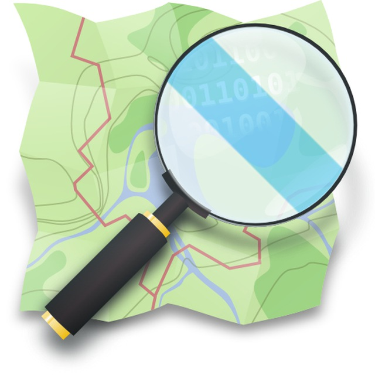

<!-- README.md is generated from README.Rmd. Please edit that file -->

```{r, include = FALSE}
knitr::opts_chunk$set(
  collapse = TRUE,
  comment = "#>",
  fig.path = "man/figures/README-",
  out.width = "100%"
)
```

# monitorOSM_GZ 

<!-- badges: start -->

[](https://github.com/OSM-Catalan/monitorOSM/actions/workflows/quarto-publish.yml)
[](https://github.com/OSM-Catalan/monitorOSM/actions/workflows/pkgdown.yaml)
[](https://github.com/OSM-Catalan/monitorOSM/actions/workflows/R-CMD-check.yaml) 
[](https://github.com/OSM-Catalan/monitorOSM/actions/workflows/pre-commit.yaml)
<!-- [](https://github.com/OSM-Catalan/monitorOSM/actions/workflows/test-coverage.yaml) -->

<!-- badges: end -->

`monitorOSM` é un repositorio usado para supervisar os cambios en [OpenStreetMap](http://www.openstreemap.com)
comparando obxectos con [bases de datos de referencia](https://github.com/jesbrz/monitorOSM/tree/main/data-raw).

Podes ver os informes que se actualizan diariamente en <https://jesbrz.github.io/monitorOSM>. Os informes dos 
cambios mostran táboas co estado das etiquetas en OSM e nas bases de datos de referencia:

```{r exemple diferències, echo=FALSE}
referencia <- data.frame(
  osm_url = "http://osm.org/node/XXXX", `name:ca` = "nom de referència", name = "Sense canvis",
  wikipedia = "ca:Eliminat", check.names = FALSE
)
osm <- data.frame(
  osm_url = "http://osm.org/node/XXXX", `name:ca` = "nom a OSM", name = "Sense canvis",
  wikipedia = NA_character_, check.names = FALSE
)

dif <- suppressWarnings(suppressMessages(
  compareDF::compare_df(df_new = osm, df_old = referencia, group_col = "osm_url", stop_on_error = FALSE)
))
suppressMessages(compareDF::create_output_table(dif, change_col_name = "canvi"))
```

Tamén mostra que conxuntos de cambios teñen etiquetas rotas con ligazóns se queres deixar comentarios.


## Engadir novos obxectos ás bases de datos

Se queres engadir obxectos coas súas etiquetas ás bases de datos, podes abrir un
[ticket](https://github.com/OSM-Catalan/monitorOSM/issues) ou podes tentar facer un PR coas instrucións que atoparás
en [aquí](https://osm-catalan.github.io/monitorOSM/data-raw/README.html). Sería mellor que os estados de referencia
dos obxectos están acordados co
[Comunidade de OpenStreetmap en catalán](https://wiki.openstreetmap.org/wiki/WikiProject_Catalan#Canals_de_comunicaci%C3%B3_i_mitjans_de_difusi%C3%B3).


## Paquete de R

A consulta, a comparación con bases de datos de referencia e a representación da web realízanse cun paquete
desde [R](https://cran.r-project.org/) e accións de github. O paquete tamén inclúe funcións para restaurar obxectos de
xeito rápido, pero como proxecto comunitario, é importante tentar falar con usuarios que non estean de acordo coas bases
de datos de referencia. Consulte a [documentación do paquete R] (https://osm-catalan.github.io/monitorOSM/docs/reference/)
para máis detalles.

### Exemplo de restauración

Instala o paquete R:

``` r
# install.packages("remotes")
remotes::install_github("OSM-Catalan/monitorOSM")
```

Restauración das etiquetas `nome` e `wikipedia` das comarcas do País Valenciano:

``` r
library(monitorOSM)

id <- modifica_etiquetes_osm(
  comarques[comarques$regio == "PV", ],
  claus = c("name", "wikipedia"),
  comentari = "Restaura els noms de les comarques dels País Valencià", hashtags = "monitorOSM"
)
```
Devolve o identificador do conxunto de cambios.
